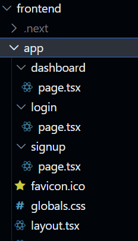

AuthFlow - Full-Stack Authentication Starter

AuthFlow is a modern full-stack authentication starter built with Next.js and Flask, featuring secure login, JWT authentication, protected routes, and a polished SaaS-style UI.

This project demonstrates how to build and integrate a modern React frontend with a Python REST API backend.

## Highlights

- Built a full authentication lifecycle: registration, login, protected routes, logout, and token-verified API access.
- Integrated a modern Next.js frontend with a production-style Flask REST API using JWT-based auth.
- Implemented frontend route protection and auth state handling for secure navigation flows.
- Designed a polished SaaS-style interface with responsive layouts and clear user feedback states.
- Structured the codebase with separation of concerns for scalability across frontend and backend.

## Demo Links

<!-- [](#)
[](./frontend)
[](./backend)
[](#api-endpoints) -->


## Why This Project Matters

Authentication is a core requirement in almost every real-world product, and this project demonstrates the exact engineering skills: secure API design, frontend-backend integration, route protection, token management, and user-centric UI implementation. It shows practical full-stack capability from data layer to user experience, not just isolated frontend or backend code.

## Features

- User registration
- Secure login
- JWT authentication
- Protected dashboard route
- Logout functionality
- Token-based API access
- Modern SaaS-style UI
- Password visibility toggle
- API error handling
- Clean full-stack architecture

## Tech Stack

### Frontend

- Next.js
- Tailwind CSS
- Axios
- Lucide Icons
- LocalStorage token management

### Backend

- Flask
- Flask-JWT-Extended
- Flask-SQLAlchemy
- Flask-CORS
- SQLite database
- Python dotenv configuration

## Architecture

```text
Client (Next.js)
↓
HTTP Requests
↓
Flask REST API
↓
JWT Authentication
↓
SQLite Database
```

### Authentication Flow

1. User Signup → Flask API → Database
2. User Login → JWT Token Issued
3. Token Stored in LocalStorage
4. Dashboard Request → JWT Verified
5. Protected Data Returned

## Project Structure

```text
authflow-nextjs-flask
│
├── backend
│   ├── app
│   │   ├── models
│   │   │   └── user.py
│   │   ├── routes
│   │   │   ├── auth.py
│   │   │   └── user.py
│   │   ├── config.py
│   │   ├── extensions.py
│   │   └── __init__.py
│   │
│   ├── run.py
│   └── requirements.txt
│
├── frontend
│   ├── app
│   │   ├── login
│   │   ├── signup
│   │   └── dashboard
│   │
│   ├── lib
│   │   ├── api.ts
│   │   └── auth.ts
│   │
│   └── package.json
│
└── README.md
```

## Running the Project Locally

### 1. Clone the repository

```bash
git clone https://github.com/PreeNJ/authflow-nextjs-flask.git
cd authflow-nextjs-flask
```

### Backend Setup (Flask)

1. Navigate to backend folder

```bash
cd backend
```

2. Create virtual environment

```bash
python -m venv venv
```

3. Activate environment

Mac / Linux:

```bash
source venv/bin/activate
```

Windows:

```bash
venv\Scripts\activate
```

4. Install dependencies

```bash
pip install -r requirements.txt
```

5. Run the backend server

```bash
python run.py
```

Backend runs on:

```text
http://127.0.0.1:5000
```

### Frontend Setup (Next.js)

Open a new terminal.

1. Navigate to frontend

```bash
cd frontend
```

2. Install dependencies

```bash
npm install
```

3. Run development server

```bash
npm run dev
```

Frontend runs on:

```text
http://localhost:3000
```

## API Endpoints

### Register

`POST /auth/register`

Example request:

```json
{
	"email": "user@example.com",
	"password": "123456"
}
```

### Login

`POST /auth/login`

Response:

```json
{
	"access_token": "JWT_TOKEN",
	"user": {
		"id": 1,
		"email": "user@example.com"
	}
}
```

### Protected Profile

`GET /user/profile`

Header required:

```text
Authorization: Bearer <JWT_TOKEN>
```

## Screenshots

Add screenshots of your UI here.

- Landing Page

- Login Page

- Dashboard


<!-- Example:

```text
/screenshots/landing.png
/screenshots/login.png
/screenshots/dashboard.png -->
```

## Future Improvements

- Refresh tokens
- OAuth login (Google / GitHub)
- Email verification
- Password reset
- Role-based authorization
- Docker deployment
- CI/CD pipeline

## Deployment

### Frontend

- Vercel

### Backend
 
- Railway

## Author

Priscillah Njai

GitHub:
https://github.com/PreeNJ

## License

MIT License
